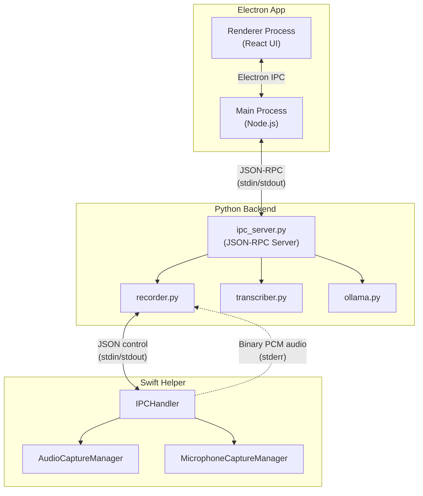
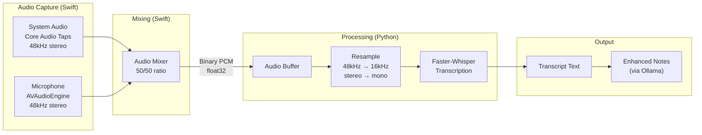

# CLAUDE.md

This file provides guidance to Claude Code (claude.ai/code) when working with code in this repository.

## Project Overview

Courier is a local-first macOS meeting recorder built with Electron + React + Python + Swift. It captures system audio and microphone using native Core Audio Taps, transcribes using local Whisper models, and generates enhanced meeting notes via Ollama LLMs. All processing happens locally - no cloud dependencies. Requires macOS 14.2+.

## Running the Application

```bash
# Requirements: macOS 14.2+ (Sonoma or later), Node.js 18+

# Install Python dependencies (for backend)
pip install -r requirements.txt

# Build Swift audio helper (requires Xcode/Swift toolchain)
# Note: Pre-built binary is included in app/bin/ - only rebuild if needed
./build_helper.sh

# Install Electron app dependencies
cd desktop && npm install

# Run the Electron app (development mode)
cd desktop && npm run dev

# First run: Grant "Screen & System Audio Recording" and "Microphone" permissions when prompted

# Ollama must be running for note generation
ollama serve  # In separate terminal
```

## Architecture

Courier uses a hybrid architecture: an Electron app for the UI, with a Python backend for ML/AI tasks.

```
┌─────────────────────────────────────────────────────────────┐
│                    Electron App (desktop/)                   │
│  React + TypeScript UI with Radix design system             │
│                                                              │
│  ┌─────────────────────────────────────────────────────────┐│
│  │ Renderer Process (React)                                 ││
│  │  - SettingsModal, RecordingControls, NotesEditor        ││
│  │  - Design tokens in desktop/src/renderer/design/        ││
│  └─────────────────────────────────────────────────────────┘│
│                            │                                 │
│                     IPC (JSON-RPC)                          │
│                            │                                 │
│  ┌─────────────────────────────────────────────────────────┐│
│  │ Main Process                                             ││
│  │  - PythonBridge spawns Python backend                   ││
│  │  - SQLite database for settings                         ││
│  └─────────────────────────────────────────────────────────┘│
└─────────────────────────────────────────────────────────────┘
                            │
                     Subprocess (JSON-RPC)
                            │
┌─────────────────────────────────────────────────────────────┐
│                    Python Backend (app/)                     │
│                                                              │
│  ipc_server.py    - JSON-RPC server for Electron            │
│  ipc_protocol.py  - IPC communication protocol              │
│  recorder.py      - CoreAudioTapRecorder + mic capture      │
│  transcriber.py   - Faster-Whisper transcription            │
│  ollama.py        - LLM integration for notes               │
└─────────────────────────────────────────────────────────────┘
                            │
                     Subprocess (IPC)
                            │
┌─────────────────────────────────────────────────────────────┐
│               Swift Helper (courier-audio-helper/)           │
│                                                              │
│  AudioCaptureManager.swift   - Core Audio Taps + mic mixing │
│  MicrophoneCaptureManager.swift - AVAudioEngine mic capture │
│  RingBuffer.swift            - Audio synchronization        │
│  IPCHandler.swift            - IPC protocol handler         │
│  main.swift                  - Entry point                  │
└─────────────────────────────────────────────────────────────┘
```

## Architecture Diagrams (Mermaid)

The diagrams below use Mermaid syntax for maintainability. While they won't render in plain text, the syntax is readable and understood by Claude.

### IPC Communication Flow

Shows how the three main components communicate:



### Audio Pipeline

Shows how audio flows from capture to transcription:



### Recording Session Sequence

Shows the runtime flow of a typical recording session:

```mermaid
sequenceDiagram
    participant User
    participant Renderer as Renderer (React)
    participant Main as Main Process
    participant Python as Python Backend
    participant Swift as Swift Helper
    participant Ollama as Ollama LLM

    User->>Renderer: Click "Start Recording"
    Renderer->>Main: startRecording()
    Main->>Python: JSON-RPC: start_recording
    Python->>Swift: Spawn helper process
    Swift->>Swift: Initialize Core Audio Taps
    Swift->>Swift: Initialize Microphone
    Swift-->>Python: Audio stream (binary PCM via stderr)

    loop During Recording
        Swift-->>Python: Continuous audio chunks
        Python->>Python: Buffer audio data
    end

    User->>Renderer: Click "Stop Recording"
    Renderer->>Main: stopRecording()
    Main->>Python: JSON-RPC: stop_recording
    Python->>Swift: Send stop command
    Swift->>Swift: Cleanup audio sessions
    Python->>Python: Save audio to file

    Python->>Python: Transcribe with Whisper
    Python-->>Main: Streaming transcript chunks
    Main-->>Renderer: Update transcript display

    User->>Renderer: Click "End Meeting"
    Renderer->>Main: enhanceNotes()
    Main->>Python: JSON-RPC: enhance_notes
    Python->>Ollama: Stream prompt + notes + transcript
    Ollama-->>Python: Streaming tokens
    Python-->>Main: Streaming enhanced notes
    Main-->>Renderer: Update enhanced notes display
```



### Electron App (`desktop/`)

**Entry point:** `desktop/src/main/index.ts`

**Key files:**
- `src/main/python-bridge.ts` - Spawns Python backend, handles JSON-RPC communication
- `src/main/ipc-handlers.ts` - IPC handlers for renderer process
- `src/main/database/` - SQLite database for settings persistence
- `src/renderer/App.tsx` - Main React application
- `src/renderer/components/` - UI components (SettingsModal, RecordingControls, etc.)
- `src/renderer/design/` - Design system tokens (colors, spacing, typography)
- `src/renderer/hooks/` - React hooks (useRecording, useSettings, useTranscription)

### Python Backend (`app/`)

**Entry point for Electron:** `python -m app.ipc_server`

**Core modules:**
- `ipc_server.py` - JSON-RPC server that handles Electron requests
- `ipc_protocol.py` - IPC message parsing and serialization
- `recorder.py` - CoreAudioTapRecorder: manages Swift helper subprocess, audio buffering
- `transcriber.py` - Faster-Whisper transcription pipeline
- `ollama.py` - LLM integration for note enhancement

### Swift Helper (`courier-audio-helper/`)

**Audio capture components:**
- `AudioCaptureManager.swift` - Core Audio Taps for system audio + mixing
- `MicrophoneCaptureManager.swift` - AVAudioEngine for microphone capture
- `RingBuffer.swift` - Lock-free ring buffer for audio synchronization
- `IPCHandler.swift` - IPC protocol (JSON control + binary audio)
- `main.swift` - Entry point, CLI argument handling

**Audio flow:**
1. System audio captured via Core Audio Taps (48kHz stereo)
2. Microphone captured via AVAudioEngine (converted to 48kHz stereo)
3. Both sources mixed at 50/50 ratio in Swift
4. Mixed audio streamed to Python via stderr (size-prefixed binary PCM)
5. Python resamples to 16kHz mono for Whisper transcription

## Key Patterns

- **JSON-RPC for Electron ↔ Python:** Typed request/response protocol via stdin/stdout
- **Binary audio streaming:** Size-prefixed PCM float32 over stderr (Python ↔ Swift)
- **Callback pattern:** Functions accept `on_error`, `on_complete`, `on_progress` callbacks
- **Config dataclasses:** AudioConfig, TranscriberConfig, OllamaConfig for typed configuration
- **Lazy model loading:** Whisper models loaded on first transcription, then cached
- **Graceful degradation:** If microphone unavailable, recording continues with system audio only

## Design System

The Electron app uses a comprehensive design system based on Radix colors:

- **Colors:** Jade (primary), Pink (accent), Slate (neutral), Red (error) - see `desktop/src/renderer/design/tokens/colors.ts`
- **Spacing:** 4px base unit scale - see `desktop/src/renderer/design/tokens/spacing.ts`
- **Typography:** Geist font family - see `desktop/src/renderer/design/tokens/typography.ts`
- **Documentation:** See `STYLING.md` for full design system documentation

## Technical Details

- **System requirements:** macOS 14.2+ (Sonoma or later)
- **Audio capture:** Core Audio Taps (system-wide) + AVAudioEngine (microphone)
- **Permissions:** Screen & System Audio Recording + Microphone
- **Whisper models:** tiny, base, small, medium (default), large-v3
- **Compute detection:** CUDA → MPS → CPU with int8 quantization
- **Default language:** Dutch (nl), supports EN, DE, FR, ES, IT, PT
- **Ollama endpoint:** http://localhost:11434
- **Audio format:** 16kHz mono float32 required for Whisper
- **Build:** `build_helper.sh` creates universal binary (ARM64 + x86_64)
